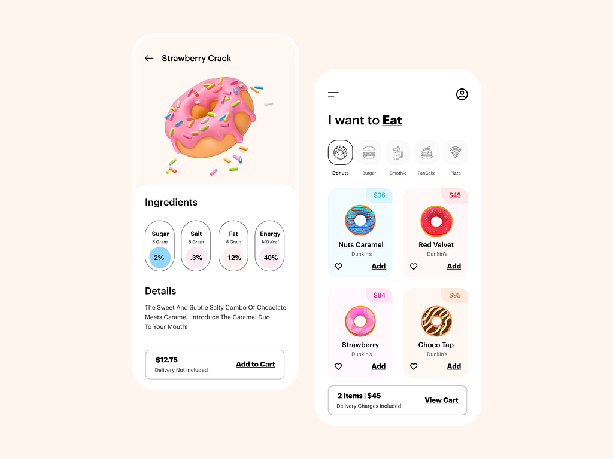

# **Donuts Shop App**

[](LICENSE)
[](https://github.com/your-username/repository-name/releases)



## 📱 **App Overview**

**Donuts Shop App** is a Flutter-based mobile application that showcases various types of donuts with detailed nutritional information, including sugar, salt, fat, and energy content. Users can explore each donut's name, description, color, and price, and interact with the app to add items to their cart, view the total price, and save their favorite donuts.

## ✨ **Features**

- 🍩 **View Donuts** – Browse a selection of donuts, with each item displaying detailed nutritional information like sugar, salt, fat, and energy content.
- 🛒 **Cart Functionality** – Add donuts to the cart and view the total price dynamically.
- ❤️ **Favorites** – Mark and save favorite donuts for easy access.
- 💬 **Detailed Information** – See comprehensive details, including the name, description, price, and color of each donut.
- 🔄 **Responsive UI** – Enjoy a seamless user experience across different screen sizes and orientations.

## 🛠 **Technologies Used**

- **Flutter (Dart)** – For building the app’s user interface and managing app logic.

## 🚀 **Getting Started**

### **Prerequisites**

- Flutter SDK: [Install Flutter](https://flutter.dev/docs/get-started/install)
- Dart 2.x or later

### **Installation**

1. Clone the repository:

   ```bash
   git clone https://github.com/dine-issam/Donuts-Shop-App.git
   ```

2. Navigate into the project directory:

   ```bash
   cd Donuts-Shop-App
   ```

3. Install the required dependencies:

   ```bash
   flutter pub get
   ```

4. Run the app:

   ```bash
   flutter run
   ```
  

## 🤝 **Contributing**

We welcome contributions! If you would like to contribute, feel free to fork the repository and submit a pull request.

## 📝 **License**

This project is licensed under the MIT License – see the [LICENSE](LICENSE) file for details.

## Contact

For any questions or feedback, feel free to reach out to me on [LinkedIn](https://linktr.ee/your-username).
